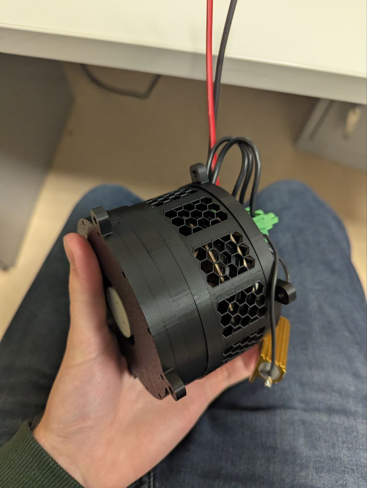

# 🚧 Work in Progress

This is repo for my 12 DOF quadruped robot Reinforced Learning project.

# 📝Project Plan 

- Design full working CAD model(Current Stage)
- Setup ROS for this robot
- Setup MuJoCo simulation environment for it
- Build reinforced learning pipeline for teaching it to walk on uneven terrain
- Build it in reality
- Iterate

# ⚙️Current progress

### Custom actuator

Custom working actuator has 7:1 reduction ratio based on a mix of cycloidal and planetary gearbox.

